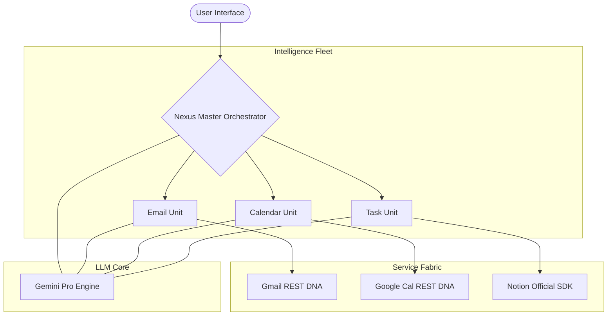

<div align="center">


# 🌌 Nexus AI
### The Autonomous Digital Executive for the Hyper-Productive

<br/>

[](https://github.com/Ismail-2001/Personal-Task-Automation-Agent)
[](https://ai.google.dev)
[](https://langchain.com)
[](./LICENSE)

<br/>

> **"Nexus doesn't just manage your tasks. It reclaims your time."**

Nexus AI is a sophisticated **multi-agent orchestration system** designed to eliminate the cognitive overhead of modern digital work. By integrating deeply with your core communication and productivity stacks (Gmail, Calendar, Notion), Nexus acts as your autonomous executive assistant—processing information, scheduling your life, and organizing your priorities with surgical precision.

[**Explore Features**](#-core-capabilities) • [**Architecture**](#-the-nexus-architecture) • [**Quick Start**](#-deployment-guide) • [**Vision**](#-future-roadmap)

---

</div>

## 💎 The Nexus Philosophy

In an era of information fragmentation, high-performers are taxed by the "Digital Toll": constant context switching between tabs, triaging inboxes, and manual calendar syncing.

**Nexus AI solves this by:**
- **Centralizing Intelligence:** One interface for your entire workspace.
- **Autonomous Delegation:** Specialized agents handle the heavy lifting.
- **Synthesized Awareness:** Don't just see data; get actionable briefings.

---

## 🚀 Core Capabilities

### ⚡ Master Orchestrator
The neural center of Nexus. It uses high-dimensional semantic analysis to route your requests to the most qualified intelligence unit.
- **Intent Recognition:** Seamlessly distinguishes between scheduling, communication, and organizational tasks.
- **Workflow Automation:** Executes complex "Daily Briefings" that pull from all services simultaneously.

### 📧 Email Intelligence (Gmail)
More than just a reader. It’s an Filter for your digital noise.
- **Autonomous Synthesis:** Summarizes entire threads into actionable bullet points.
- **Priority Tiering:** Surfaces what matters most, burying the fluff.
- **Natural Language Querying:** "Nexus, what did the design team say about the Q4 budget?"

### 📅 Temporal Management (Google Calendar)
Precision scheduling without the back-and-forth.
- **Smart Creation:** Interprets vague timing like "sometime next Tuesday afternoon" into concrete events.
- **Conflict Vigilance:** Monitors for scheduling overlaps before they become problems.
- **Dynamic Updates:** Reschedule with a single command.

### ✅ Organizational Structure (Notion)
The ultimate bridge between inspiration and execution.
- **Instant Triage:** Converts email action items into Notion database entries instantly.
- **Database Orchestration:** Full CRUD capabilities over your Notion task lists.
- **Status Persistence:** Tracks progress from "Brainstorm" to "Completed".

---

## 🏗️ The Nexus Architecture

Built on a robust **4-Layer Decoupled Framework** to ensure peak performance and horizontal scalability.



---

## 🛠️ Tech Stack

| Component | Technology | Purpose |
|:--- |:--- |:--- |
| **Logic** | Python 3.10+ | Primary execution runtime |
| **Orchestration** | LangChain / LangGraph | Multi-agent state management |
| **LLM Engine** | Google Gemini Pro | High-level reasoning & synthesis |
| **Communication** | Gmail REST API | Global email connectivity |
| **Temporal** | Google Calendar API | Scheduling & lifecycle management |
| **Persistence** | Notion API | Structured organizational data |
| **Validation** | Pydantic v2 | Type-safe data integrity |

---

## 📦 Deployment Guide

### 1. Zero-Touch Installation
```bash
# Clone the intelligence
git clone https://github.com/Ismail-2001/Personal-Task-Automation-Agent.git
cd Personal-Task-Automation-Agent

# Initialize Environment
python -m venv venv
source venv/bin/activate # or venv\Scripts\activate on Windows

# Install Dependencies
pip install -r requirements.txt
```

### 2. Identity Verification
1.  Configure **Google Cloud Console** (Enable Gmail & Calendar APIs).
2.  Download `credentials.json` to the `credentials/` folder.
3.  Set up your **Notion Internal Integration** and share your database.

### 3. Environment Synergy
Create a `.env` file with your cryptographic keys:
```env
GOOGLE_CLIENT_ID=...
GOOGLE_CLIENT_SECRET=...
NOTION_API_KEY=...
NOTION_DATABASE_ID=...
GEMINI_API_KEY=...
LOG_LEVEL=INFO
```

---

## 💡 System Interaction

Run the core node:
```bash
python -m src.main
```

Interacting with Nexus:
> *"Nexus, synthesize my unread emails and check if I have any calendar conflicts tomorrow morning."*

> *"Nexus, create a high-priority task for 'Project Alpha Launch' and notify me if any emails arrive regarding stakeholders."*

---

## 🔭 Future Roadmap

- [ ] **Phase 1:** Real-time WebSocket Dashboard (Next).
- [ ] **Phase 2:** Short-term memory via Vector Embeddings.
- [ ] **Phase 3:** Voice Interface (Whisper API Integration).
- [ ] **Phase 4:** Autonomous Multi-User Collaboration.

---

<div align="center">

**Crafted for those who demand excellence from their digital ecosystem.**

*If Nexus reclaimed your time, consider bestowing a star ⭐*

[](https://github.com/Ismail-2001/Personal-Task-Automation-Agent)

**Maintained by Ismail Sajid & Enhanced by Antigravity**

</div>
