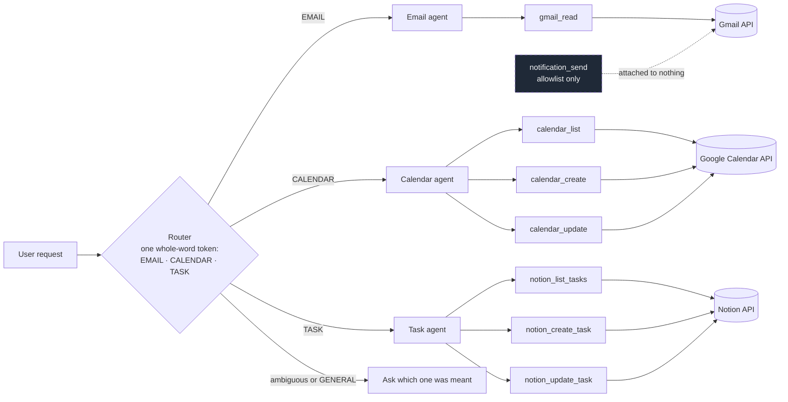
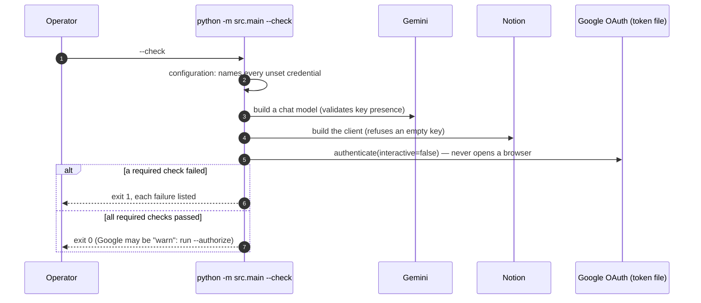
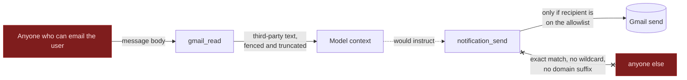

# Nexus AI

[](https://github.com/daniellopez882/The-Autonomous-Digital-Executive-for-the-Hyper-Productive/actions/workflows/ci.yml)


A LangGraph agent over three personal-productivity surfaces — Gmail (read),
Google Calendar (read/write) and a Notion task database (read/write). A
routing model picks one of three specialist sub-agents, each holding only the
tools for its own surface. When the routing answer is ambiguous, it asks
rather than guesses.

## At a glance

| | |
|---|---|
| **Is** | A single-user CLI: `--check` (preflight), `--authorize` (Google OAuth once), `--ask "…"` |
| **Is not** | A service. No HTTP surface, no persistence between invocations, never deployed anywhere |
| **Tests** | 202 collected: 201 pass, 1 skipped on Windows (POSIX file modes). None touch a network or need a credential |
| **CI** | lint · tests on 3.11/3.12 · preflight asserted to **fail** without credentials and pass with them · bandit · container built, run as non-root, preflight checked inside it |
| **Container** | multi-stage, uid 10001, preflight as `HEALTHCHECK`, `credentials/` as a volume |
| **Sends mail?** | Only to an explicit allowlist, and the send tool is attached to no agent — see below |

## Architecture


```mermaid
flowchart LR
    U[User request] --> R{Router<br/>one whole-word token:<br/>EMAIL · CALENDAR · TASK}
    R -->|EMAIL| E[Email agent]
    R -->|CALENDAR| C[Calendar agent]
    R -->|TASK| T[Task agent]
    R -->|ambiguous or GENERAL| A[Ask which one was meant]
    E --> E1[gmail_read]
    C --> C1[calendar_list]
    C --> C2[calendar_create]
    C --> C3[calendar_update]
    T --> T1[notion_list_tasks]
    T --> T2[notion_create_task]
    T --> T3[notion_update_task]
    E1 --> GM[(Gmail API)]
    C1 & C2 & C3 --> GC[(Google Calendar API)]
    T1 & T2 & T3 --> NO[(Notion API)]
    S[notification_send<br/>allowlist only] -. attached to nothing .-> GM
    classDef off stroke-dasharray: 5 5,fill:#1f2937,color:#f3f4f6
    class S off
```

### Preflight, which is the entry point


```mermaid
sequenceDiagram
    autonumber
    participant Op as Operator
    participant M as python -m src.main --check
    participant G as Gemini
    participant N as Notion
    participant OA as Google OAuth (token file)

    Op->>M: --check
    M->>M: configuration: names every unset credential
    M->>G: build a chat model (validates key presence)
    M->>N: build the client (refuses an empty key)
    M->>OA: authenticate(interactive=false) — never opens a browser
    alt a required check failed
        M-->>Op: exit 1, each failure listed
    else all required checks passed
        M-->>Op: exit 0 (Google may be "warn": run --authorize)
    end
```

The previous entry point logged **"Nexus initialization complete. Systems at
100%."** unconditionally — on a machine with no credentials of any kind,
where constructing the orchestrator raised. Nothing in that path touched a
network, a credential or a model.

## Quick start

```bash
python -m venv .venv && . .venv/bin/activate    # Windows: .venv\Scripts\activate
pip install -r requirements.txt
cp .env.example .env      # then fill in GEMINI_API_KEY and the Notion values
python -m src.main --check
```

`--check` exits non-zero if a required dependency is missing. Run it first.

For Gmail and Calendar, download an OAuth client from the Google Cloud console
to `credentials/credentials.json`, then:

```bash
python -m src.main --authorize
```

That opens a browser once and stores a token at `credentials/token.json`, mode
`0600`. **That file is a credential** — it holds a refresh token that can send
mail as you. It is gitignored; keep it that way.

```bash
python -m src.main --ask "what is on my calendar this week?"
```

### Container

```bash
docker build -t nexus-ai .
docker run --rm --env-file .env -v "$PWD/credentials:/app/credentials" nexus-ai --check
```

Mount `credentials/` as a volume. Do not copy it into the image — that writes a
refresh token into a layer.

## Configuration

Every setting, with its default, is in [`.env.example`](.env.example).

| Variable | Default | Notes |
|---|---|---|
| `GEMINI_API_KEY` | — | Required |
| `GEMINI_MODEL` | `gemini-2.5-flash` | Was hardcoded as `gemini-pro` in four places; that alias is retired |
| `NOTION_API_KEY` / `NOTION_DATABASE_ID` | — | Required |
| `GOOGLE_CREDENTIALS_PATH` / `GOOGLE_TOKEN_PATH` | `credentials/…` | OAuth client and stored token |
| `CALENDAR_LOOKAHEAD_DAYS` | `30` | The window `calendar_list` reads. 1–365 |
| `NOTIFICATION_ALLOWED_RECIPIENTS` | *(empty)* | **Empty disables the send tool.** Exact addresses, comma-separated, no wildcard |

## The send-email tool


```mermaid
flowchart LR
    ATT[Anyone who can email the user] -->|message body| GR[gmail_read]
    GR -->|third-party text,<br/>fenced and truncated| CTX[Model context]
    CTX -.->|would instruct| SEND[notification_send]
    SEND -->|only if recipient is<br/>on the allowlist| OUT[(Gmail send)]
    SEND x--x|exact match, no wildcard,<br/>no domain suffix| BLOCK[anyone else]
    classDef bad fill:#7f1d1d,color:#fee2e2,stroke:#991b1b
    class ATT,BLOCK bad
```

`gmail_read` puts text written by arbitrary senders into the model's context.
`notification_send` sends mail as you. An agent holding both is an
exfiltration path. Two controls, both in code — a prompt instruction is exactly
what an injected message overrides:

1. `NOTIFICATION_ALLOWED_RECIPIENTS` is an exact-match allowlist. Empty means
   nothing can be sent. `owner@example.com.evil.example` is refused (tested).
2. The tool is attached to no agent. A test asserts, on the AST, that the
   email agent does not reference it.

## What changed, and why

Every defect below was reproduced on the original code before it was fixed.

| # | Defect | Effect |
|--:|---|---|
| 1 | `main()` logged "Systems at 100%" after constructing three objects in `try` blocks | The only success signal was unconditional |
| 2 | `list_events` had no `timeMin` | "What's on today?" returned the calendar's ten **oldest** events |
| 3 | `retry_with_backoff` caught bare `Exception` around `create_event` / `create_page` | A lost response booked the meeting again — up to four copies |
| 4 | It also retried 401/403/404 and `ValueError` | Seven seconds of sleeping before an error that could never succeed |
| 5 | `if "EMAIL" in decision`, tested first, over free model text | "Not an EMAIL request, use CALENDAR" went to the email agent |
| 6 | `langgraph` undeclared; no version pins at all | Worked only because `langchain` 1.x happens to depend on it |
| 7 | Token written into `credentials/`, which is gitignored and absent on a fresh checkout | `FileNotFoundError` **after** consent — the grant was thrown away every run |
| 8 | Token written world-readable | A refresh token for `gmail.send`, readable by every account on the machine |
| 9 | `notification_send` sent to any recipient | With `gmail_read` on the same agent, an exfiltration path |
| 10 | Every tool returned `str(exception)` to the model | `HttpError` renders the full request URI into the context |

<details>
<summary>Six more</summary>

| # | Defect |
|--:|---|
| 11 | `from_authorized_user_file` unguarded — a truncated token file raised out of `authenticate()` |
| 12 | Full `calendar` scope requested; nothing needs more than `calendar.events` |
| 13 | `calendar_create` sent a `dateTime` with no offset and no `timeZone` — a 400 for the common case |
| 14 | `notion_list_tasks` indexed `['text']['content']` — one @-mention in a title broke the listing |
| 15 | `event['start']` — a cancelled recurring instance has none; one such event lost every other |
| 16 | Four model clients and every tool built eagerly in `__init__`; `gemini-pro` hardcoded four times |

</details>

## Design notes

| Record | Decision |
|---|---|
| [ADR 0001](docs/adr/0001-retry-policy.md) | Retries are opt-out for writes; only transient errors qualify |
| [ADR 0002](docs/adr/0002-model-factory.md) | One place builds the chat model |
| [ADR 0003](docs/adr/0003-outbound-mail.md) | An allowlist in code, not a prompt, guards outbound mail |
| [ADR 0004](docs/adr/0004-preflight.md) | The entry point is a preflight that can fail |
| [Threat model](docs/threat-model.md) | Assets, boundaries, seven threats, what is not addressed |

## Layout

```
src/
  main.py              preflight, --authorize, --ask
  agents/
    llm.py             the one place a chat model is built
    orchestrator.py    routing + the daily_summary workflow
    {email,calendar,task}_agent.py
    notification_agent.py   the send tool; attached to nothing
  services/            Google and Notion clients
  tools/               LangChain tools, and errors.py
  utils/               settings, retry, message flattening
tests/                 202 tests
benchmarks/            routing latency; needs live credentials
docs/                  ADRs, threat model
```

## Limits

- Single user, single calendar (`primary`), single Notion database.
- No persistence between invocations; each `--ask` starts fresh.
- `benchmarks/bench_routing.py` needs live credentials and is not run in CI — no latency figures here.
- The routing model is asked for one word and sometimes answers in a sentence. Handled, not solved: an ambiguous answer asks the user.

## Licence

MIT — see [LICENSE](LICENSE).
